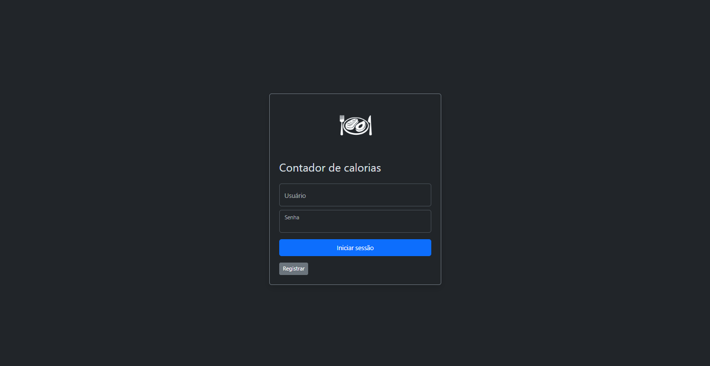
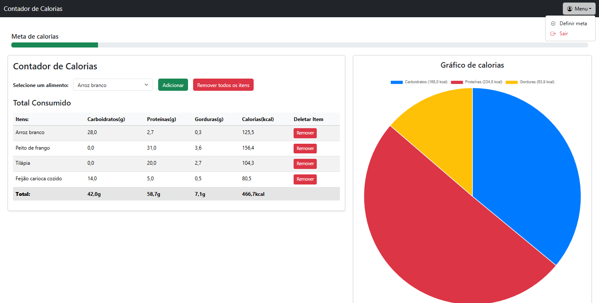

# 🍎 Contador de Calorias com Django

Olá a todos!

Gostaria de compartilhar um projeto que desenvolvi durante meus estudos
com o framework Django.

A aplicação foi desenvolvida para auxiliar no controle diário de
calorias, permitindo o registro dos alimentos consumidos ao longo do
dia, o acompanhamento da ingestão de macronutrientes (carboidratos,
proteínas e gorduras) e a visualização do total de calorias consumidas
em relação a uma meta diária personalizada.

------------------------------------------------------------------------

## ⚙️ Funcionalidades

-   Cadastro e login de usuários
-   Definição de meta diária de calorias
-   Registro de alimentos consumidos
-   Cálculo automático de calorias e macronutrientes
-   Visualização do progresso da meta diária
-   Gráfico em pizza com a distribuição calórica
-   Remoção de alimentos individualmente ou em massa
-   Interface responsiva e intuitiva

------------------------------------------------------------------------

## 🧰 Tecnologias Utilizadas

### Back-end

-   Python
-   Django
-   SQLite
-   Django ORM
-   Signals

### Front-end

-   HTML5
-   CSS3
-   Bootstrap 5
-   JavaScript
-   Chart.js

------------------------------------------------------------------------

## 🏗️ Arquitetura e Conceitos Aplicados

-   Django Authentication System
-   Relacionamentos entre modelos (ForeignKey, OneToOneField)
-   Properties para cálculos dinâmicos
-   Signals para criação automática de perfil
-   Views protegidas com login_required
-   Uso de mensagens do Django
-   Templates reutilizáveis com herança

## 🖼️ Demonstração

### Tela de Login

### Dashboard Principal

### Tela de Cadastro

